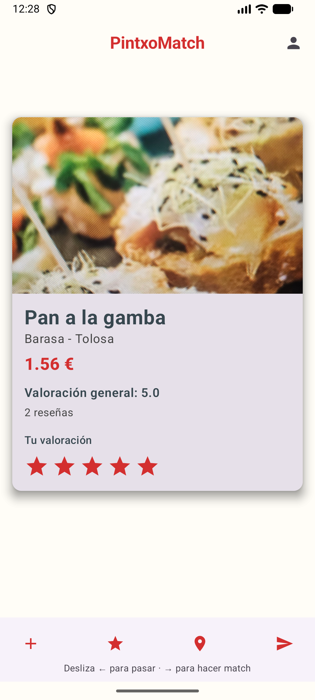
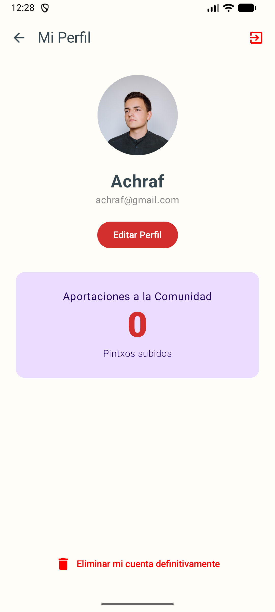
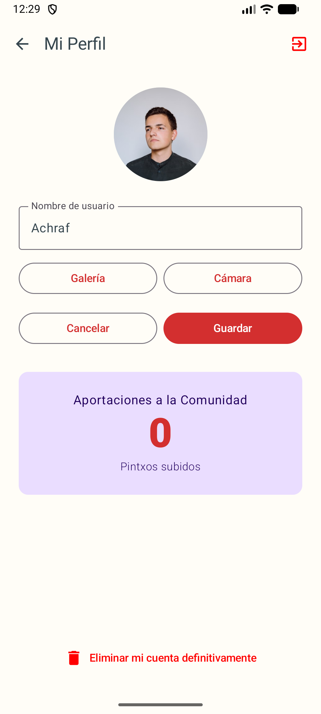
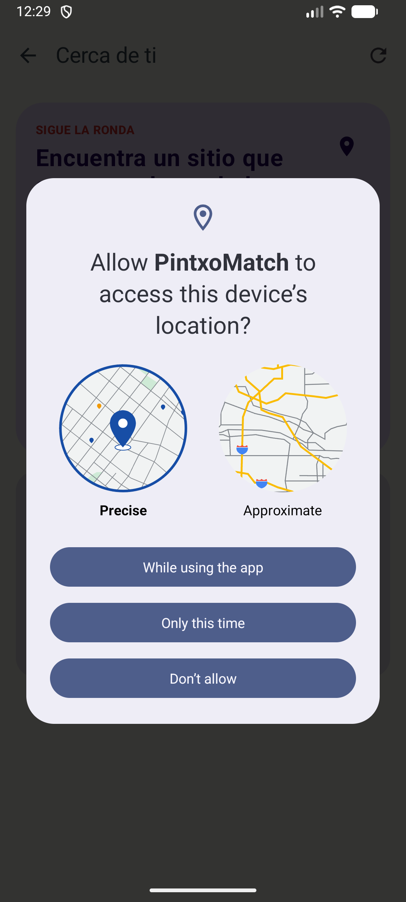
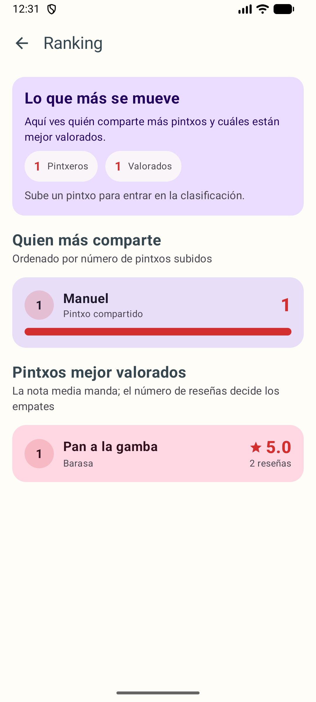
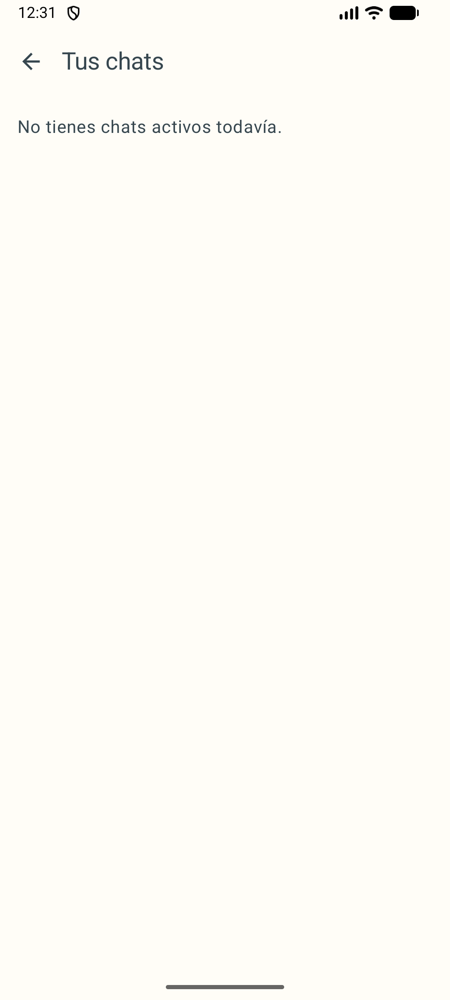

# PintxoMatch

PintxoMatch is an Android application built with Kotlin and Jetpack Compose to discover pintxos, rate them, connect with other users, and continue the experience through private chat and nearby venue exploration.

## Overview

PintxoMatch combines food discovery, lightweight social interaction, and location-based exploration in a single mobile product. Users can browse pintxos, publish new entries, rate them individually while seeing a shared community average, open private chats after a match, compare rankings, and explore nearby places on an integrated map.

## Product Scope

The project is organized around three main product areas:

- Pintxo discovery through a swipe-based browsing experience.
- Social interaction through ratings, matches, and one-to-one chat.
- Nearby venue exploration with route handoff to Google Maps.

## Core Features

- Email and password authentication with Firebase Authentication.
- Swipe-based pintxo discovery feed backed by Cloud Firestore.
- Per-user star ratings with shared average score and review counts.
- Pintxo publishing flow based on metadata and external image URLs.
- One-to-one private chat using Firebase Realtime Database.
- Chat inbox with latest message preview and manual cleanup.
- User profile with editable information and contribution stats.
- Ranking view for top contributors and best-rated pintxos.
- Nearby places screen with current location, map view, filters, and Google Maps routing.

## Interface Preview

<p align="center">
  
  
  
</p>

<p align="center">
  
  
  
</p>

Additional screenshots remain available in the `img/` directory for extended reference.

## Technology Stack

- Android UI: Kotlin, Jetpack Compose, Navigation Compose, Material 3.
- Backend: Firebase Authentication, Cloud Firestore, Firebase Realtime Database.
- Image loading: Coil.
- Mapping: osmdroid with OpenStreetMap tiles.
- Build configuration: Gradle Kotlin DSL.

## Project Structure

- `app/src/main/java/com/example/pintxomatch/`: application source code.
- `app/src/main/res/`: Android resources.
- `app/google-services.json`: Firebase Android configuration.
- `img/`: screenshots used in the project documentation.
- `gradle/` and root Gradle files: dependency and build configuration.

## Data Model

### Cloud Firestore

Collection `Pintxos`:

- `nombre: String`
- `bar: String`
- `ubicacion: String`
- `precio: Double`
- `imageUrl: String`
- `timestamp: Long`
- `uploaderUid: String`
- `uploaderEmail: String`
- `ratings: Map<String, Int>`
- `ratingCount: Long`
- `ratingTotal: Double`
- `averageRating: Double`

### Firebase Realtime Database

- `waitingByPintxo/{pintxoId}/{uid}`
  - `displayName`
  - `timestamp`

- `chats/{chatId}`
  - `pintxoId`
  - `pintxoName`
  - `updatedAt`
  - `participants/{uid}: true`
  - `participantNames/{uid}: String`
  - `messages/{messageId}`
    - `senderId`
    - `senderName`
    - `text`
    - `timestamp`

## Chat Model

- Matching is keyed by `pintxoId`.
- A chat is accessible only to users present in `participants`.
- The chat screen validates access before displaying messages.
- The flow accounts for race conditions and reopening an existing chat when appropriate.

## Local Setup

### Requirements

- Android Studio.
- JDK 11 or newer.
- A configured Firebase project.
- Location permission enabled on the device or emulator to use the nearby places feature.

### Clone the Repository

```bash
git clone <YOUR_REPOSITORY_URL>
cd PintxoMatch
```

### Firebase Configuration

1. Create a Firebase project.
2. Register an Android application with package name `com.example.pintxomatch`.
3. Download `google-services.json`.
4. Place the file in `app/google-services.json`.

`google-services.json` should remain excluded from version control.

### Required Firebase Services

- Authentication with Email/Password.
- Cloud Firestore.
- Firebase Realtime Database.

## Build and Run

```bash
./gradlew :app:assembleDebug
```

You can also run the project directly from Android Studio.

## Recommended Realtime Database Rules

```json
{
  "rules": {
    "waitingByPintxo": {
      "$pintxoId": {
        "$uid": {
          ".read": "auth != null && auth.uid === $uid",
          ".write": "auth != null && auth.uid === $uid"
        }
      }
    },
    "chats": {
      "$chatId": {
        ".read": "auth != null && data.child('participants').child(auth.uid).val() === true",
        "participants": {
          "$uid": {
            ".write": "auth != null && auth.uid === $uid"
          }
        },
        "participantNames": {
          "$uid": {
            ".write": "auth != null && auth.uid === $uid"
          }
        },
        "messages": {
          "$messageId": {
            ".write": "auth != null && data.parent().parent().child('participants').child(auth.uid).val() === true",
            ".validate": "newData.hasChildren(['senderId','senderName','text','timestamp'])"
          }
        }
      }
    }
  }
}
```

## Notes

- Older `Pintxos` documents without `uploaderUid` do not count toward user contribution statistics.
- The app currently forces a light theme for visual consistency across emulator and physical devices.
