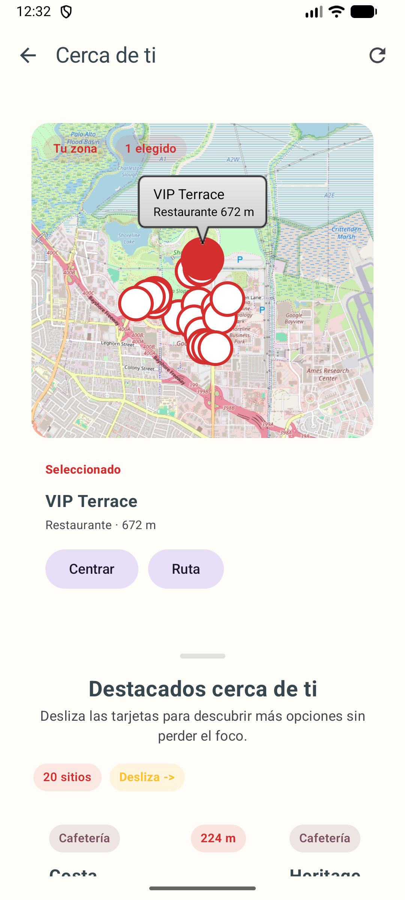
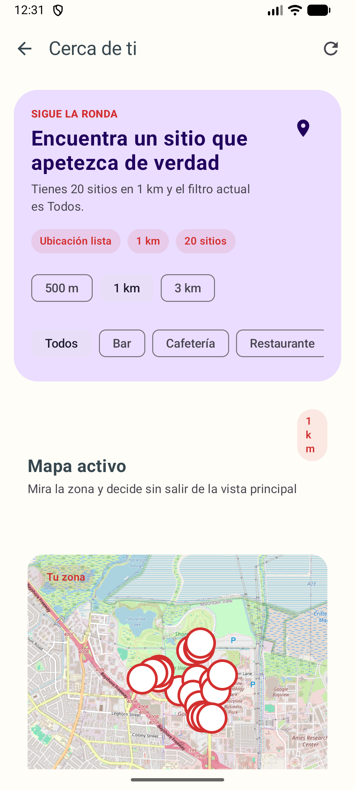

# Food View X (PintxoMatch) 🥘

[](https://kotlinlang.org/)
[](https://developer.android.com/jetpack/compose)
[](https://firebase.google.com/)
[](https://m3.material.io/)

**Food View X** is a premium Android application designed for pintxo enthusiasts. Discover, rate, and share the best culinary treasures of Gipuzkoa through a modern, swipe-based interface and a gamified community experience.

---

## 🚀 Key Features

### 🍱 Swipe-to-Match Discovery
Browse a curated feed of pintxos with smooth, fluid animations. Swipe right to "Match" (Save/Favorite) or left to "Pass". Discover your next meal in a fun, intuitive way.

### 🏆 Gamified Community Profile
Your profile is more than just settings. Inspired by premium gaming platforms, it features:
- **Pintxo XP & Levels:** Earn experience points for every contribution.
- **Achievement Showcase:** Unlock unique badges like "Crítico", "Estrella", or "Leyenda" as you explore.
- **Dynamic Headers:** Beautiful, blurred banners that reflect your personality.

### 🗺️ Nearby Exploration
Integrated map experience powered by **OSM** and **Google Maps Routing**.
- Find bars and pintxos around your current location.
- Category filters to find exactly what you're craving.
- One-tap route handoff to get you there fast.

### 💬 Community & Support
- **Reviews:** Share your thoughts and photos of every bite. Editable, verified reviews ensure quality.
- **Real-time Support:** Dedicated chat thread with admins for seamless assistance and feedback.
- **Leaderboards:** See who the top contributors are in the community.

---

## 🛠️ Technology Stack

| Category | Technology |
| :--- | :--- |
| **Android UI** | Jetpack Compose, Material 3, Navigation Compose |
| **Backend** | Firebase Auth, Cloud Firestore, Realtime Database |
| **Media & Images** | Cloudinary (Hosting), Coil (Loading) |
| **Navigation & Maps** | osmdroid (OpenStreetMap), Google Maps Intent Routing |
| **Architectures** | MVVM, Coroutines, Flow |

---

## 📱 Interface Preview

<p align="center">
  
  
  
</p>

---

## 🛠️ Local Setup

### Prerequisites
- **Android Studio** (Hedgehog or newer recommended)
- **Firebase Project:** You'll need to set up a project at [Firebase Console](https://console.firebase.google.com/).
- **Cloudinary Account:** For image hosting.

### Quick Start
1. **Clone & Open:**
   ```bash
   git clone https://github.com/mrasa/PintxoMatch.git
   ```
2. **Firebase Setup:**
   - Download `google-services.json` from your Firebase project.
   - Place it in the `app/` directory.
3. **Cloudinary Configuration:**
   - Update `CloudinarySetup` with your `cloudName` and `uploadPreset` (currently using `dm99kc8ky`).
4. **Permissions:**
   - Ensure Location and Camera permissions are granted on your device/emulator.

---

## 📊 Data Model (Simplified)

### Firestore `Pintxos`
```json
{
  "nombre": "Gilda Premium",
  "bar": "Bar Txepetxa",
  "precio": 3.50,
  "averageRating": 4.8,
  "uploaderUid": "user_123",
  "imageUrl": "cloudinary_url_here"
}
```

### Realtime Database `support_chats`
```json
{
  "threadId": {
    "meta": { "status": "open", "lastMessage": "..." },
    "messages": { ... }
  }
}
```

---

## 📜 License & Notes
- This project is part of a culinary exploration initiative.
- **Light Theme Only:** The UI is currently optimized for Light Theme to ensure visual consistency in high-contrast environments.

---
*Developed with ❤️ for the pintxo community. Bon Profit!* 🥂
