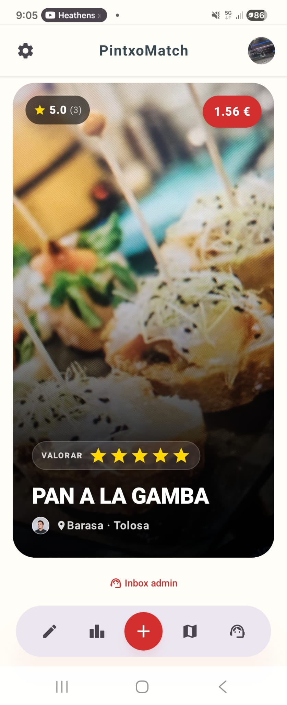
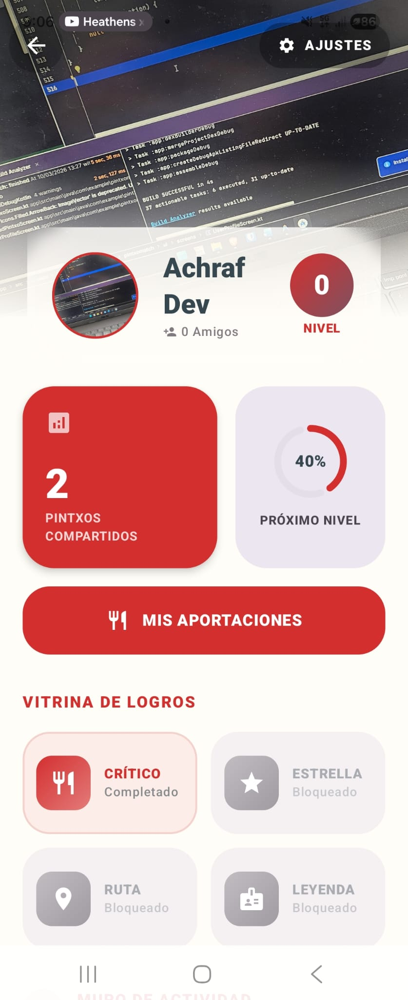
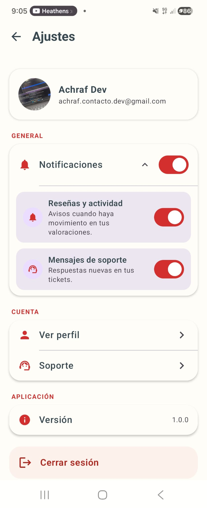

# Food View X (PintxoMatch)

Android app with a vertical food feed to discover, rate, and share pintxos, now with a retention-focused gamification layer.


## Product Vision

Food View X combines immersive vertical browsing, local food discovery, and social mechanics to build weekly user return:

- Fast visual pintxo discovery.
- Social profile and community contributions.
- Weekly retention via XP, streaks, challenges, and badges.

## Main Features

### Vertical Discovery Feed
- Vertical content browsing with fast interactions.
- Smooth Compose UI experience inspired by short-form platforms.
- Rating and profile interaction directly from feed cards.

### Community Layer
- Publish pintxos with photo, bar, location, and price.
- Reviews and rating aggregation.
- Public profile and social interactions.

### Retention and Gamification
- XP rewards by action:
  - Rate pintxo: +10 XP
  - Upload pintxo: +50 XP
- XP levels.
- Daily streak tracking.
- Active weekly challenges.
- Badge unlock rewards.
- Premium animated popup when a new badge is unlocked.

### Support and Operations
- Real-time support using Firebase Realtime Database.
- Modular architecture ready for new features without UI rewrite.

## Interface Preview

<p align="center">
  
  
  
</p>

## Tech Stack

| Layer | Stack |
|---|---|
| UI | Jetpack Compose, Material 3, Navigation Compose |
| State | ViewModel, StateFlow, Coroutines |
| Backend | Firebase Auth, Cloud Firestore, Realtime Database |
| Media | Local Image Server (Docker) + Cloudinary mode |
| Image Loading | Coil |
| Maps & Places | osmdroid + Geoapify (Places API) + external routing intents |
| Build | Gradle Kotlin DSL |

## Architecture Snapshot

- Architecture: MVVM + repositories.
- State: StateFlow with state hoisting from ViewModel.
- Async: Coroutines in viewModelScope.
- Gamification:
  - Domain rules in domain/gamification.
  - Atomic XP and badge updates with Firestore runTransaction.
  - Reusable premium Compose components for profile and challenge UI.

Technical docs:
- docs/GAMIFICATION_ARCHITECTURE.md
- docs/CHANGES.md
- docs/Roadmap/TODO.md

## Firebase Model (Gamification)

### Users/{uid}
- xp: Int
- currentStreak: Int
- lastActionTimestamp: Long
- badges: List<String>

### WeeklyChallenges/{challengeId}
- weekId, title, description
- actionType (RATE_PINTXO | UPLOAD_PINTXO)
- targetCount, badgeId
- startsAt, endsAt, isActive

### Users/{uid}/WeeklyChallengeProgress/{challengeId}
- progressCount, completed, completedAt
- targetCount, weekId, lastUpdatedAt

## Setup

### Prerequisites
- Android Studio
- Java 21 for Gradle
- Firebase project with google-services.json
- Docker Desktop for local image server mode

### Quick Start
1. Clone the repository.
2. Place google-services.json inside app/.
3. Open project in Android Studio.
4. Build and run on device or emulator.

### Dev Image Server

Recommended start script:

```powershell
.\scripts\start-dev-cloudflare.ps1
```

Manual fallback:

```powershell
docker compose -f docker-compose.image-server.yml up -d
adb reverse tcp:8080 tcp:8080
Invoke-RestMethod -Method Get -Uri "http://localhost:8080/health"
```

## Testing

Gamification testing coverage includes:

- Domain unit tests.
- Repository integration-style logic tests.
- ViewModel StateFlow tests.
- Compose render tests for gamification UI.

Run local unit tests:

```powershell
.\gradlew.bat :app:testDebugUnitTest
```

Compile instrumented tests:

```powershell
.\gradlew.bat :app:compileDebugAndroidTestKotlin
```

## Repository Structure

- app/src/main/java/com/example/pintxomatch/data
- app/src/main/java/com/example/pintxomatch/domain
- app/src/main/java/com/example/pintxomatch/ui
- docs
- docker

## Release Notes and Roadmap

- Technical changelog: docs/CHANGES.md
- Product roadmap: docs/Roadmap/TODO.md

## License

Private project for product development and validation.
