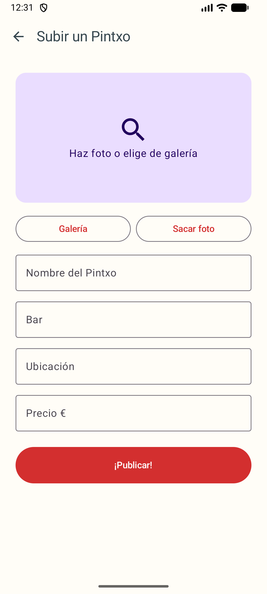
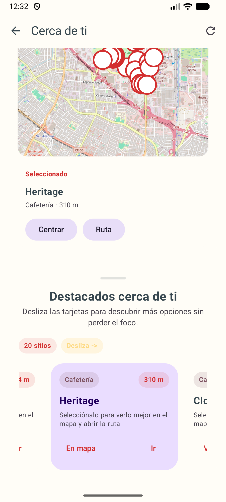
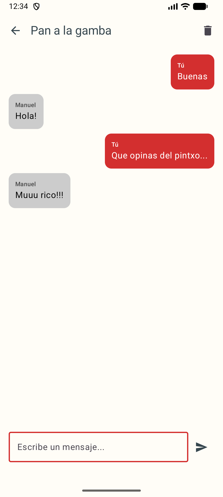

# PintxoMatch

PintxoMatch es una aplicación Android desarrollada con Kotlin y Jetpack Compose para descubrir pintxos, hacer match y conversar en chat en tiempo real.

## Resumen funcional

- Autenticación con Firebase Authentication (registro e inicio de sesión por email/contraseña)
- Feed de pintxos desde Firestore con interacción por swipe
- Valoraciones con estrellas por usuario y media global visible para todos
- Publicación de pintxos usando metadatos y URL externa de imagen (sin Firebase Storage)
- Chat privado 1 a 1 en Realtime Database
- Panel de chats con listado, último mensaje y borrado manual
- Perfil de usuario con edición de datos y estadísticas de aportaciones
- Leaderboard con ranking de usuarios por aportaciones y pintxos mejor valorados
- Sección de restaurantes cercanos con mapa integrado y ubicación actual

## Capturas

### Galería









## Tecnologías

- Android: Kotlin, Jetpack Compose, Navigation Compose, Material 3
- Backend: Firebase Authentication, Cloud Firestore, Realtime Database
- Imágenes: Coil
- Build system: Gradle Kotlin DSL

## Modelo de datos

### Firestore

Colección `Pintxos`:

- `nombre: String`
- `bar: String`
- `ubicacion: String`
- `precio: Double`
- `imageUrl: String`
- `timestamp: Long`
- `uploaderUid: String`
- `uploaderEmail: String`
- `ratings: Map<String, Int>`
- `ratingCount: Long`
- `ratingTotal: Double`
- `averageRating: Double`

### Realtime Database

- `waitingByPintxo/{pintxoId}/{uid}`
  - `displayName`
  - `timestamp`

- `chats/{chatId}`
  - `pintxoId`
  - `pintxoName`
  - `updatedAt`
  - `participants/{uid}: true`
  - `participantNames/{uid}: String`
  - `messages/{messageId}`
    - `senderId`
    - `senderName`
    - `text`
    - `timestamp`

## Flujo de chat privado

- El emparejamiento se basa en `pintxoId`.
- Un chat es visible solo para usuarios incluidos en `participants`.
- La pantalla de chat valida acceso antes de mostrar mensajes.
- El flujo contempla condiciones de carrera entre dispositivos y reapertura de chat existente cuando aplica.

## Configuración local

### Requisitos

- Android Studio
- JDK 11 o superior
- Proyecto Firebase configurado
- Permiso de ubicación en el dispositivo o emulador para la sección de restaurantes cercanos

### Instalación

```bash
git clone <TU_REPO>
cd PintxoMatch
```

### Firebase

1. Crear proyecto en Firebase.
2. Registrar app Android con `applicationId` `com.example.pintxomatch`.
3. Descargar `google-services.json`.
4. Copiarlo en `app/google-services.json`.

Nota: `google-services.json` está excluido del repositorio mediante `.gitignore`.

### Servicios necesarios en Firebase

- Authentication (Email/Password)
- Cloud Firestore
- Realtime Database (instancia europe-west1)

## Compilación y ejecución

```bash
./gradlew :app:assembleDebug
```

También se puede ejecutar directamente desde Android Studio.

## Reglas base recomendadas para Realtime Database

```json
{
  "rules": {
    "waitingByPintxo": {
      "$pintxoId": {
        "$uid": {
          ".read": "auth != null && auth.uid === $uid",
          ".write": "auth != null && auth.uid === $uid"
        }
      }
    },
    "chats": {
      "$chatId": {
        ".read": "auth != null && data.child('participants').child(auth.uid).val() === true",
        "participants": {
          "$uid": {
            ".write": "auth != null && auth.uid === $uid"
          }
        },
        "participantNames": {
          "$uid": {
            ".write": "auth != null && auth.uid === $uid"
          }
        },
        "messages": {
          "$messageId": {
            ".write": "auth != null && data.parent().parent().child('participants').child(auth.uid).val() === true",
            ".validate": "newData.hasChildren(['senderId','senderName','text','timestamp'])"
          }
        }
      }
    }
  }
}
```

## Notas

- Los documentos antiguos de `Pintxos` sin `uploaderUid` no computan en estadísticas por usuario.
- El tema visual se fuerza en modo claro para mantener consistencia entre emulador y dispositivo físico.
